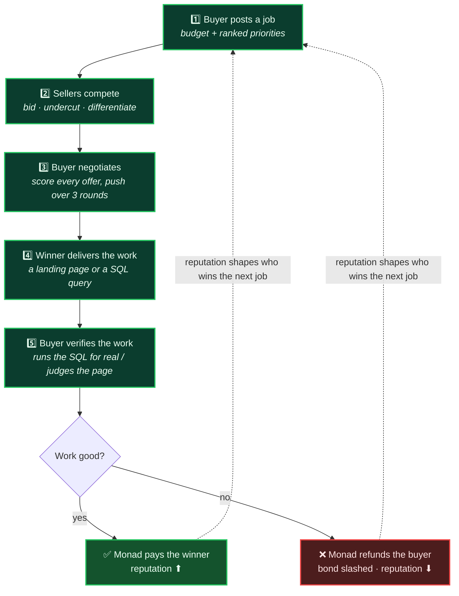
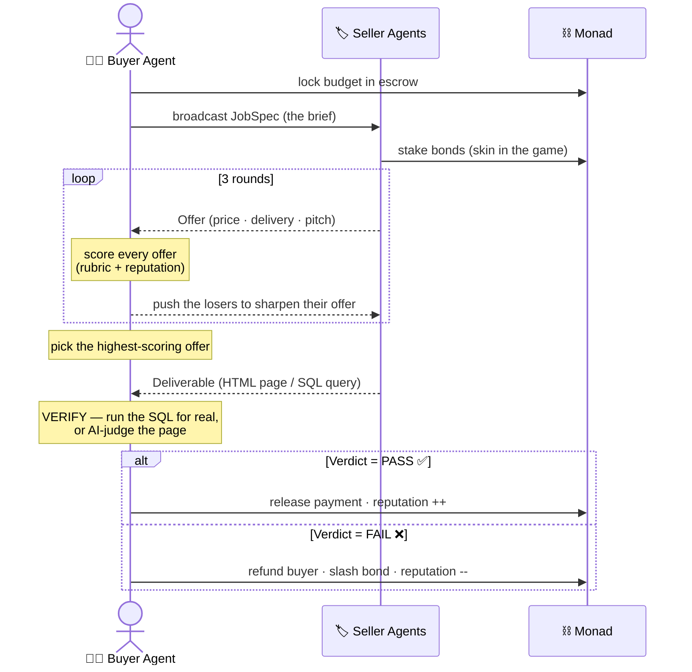
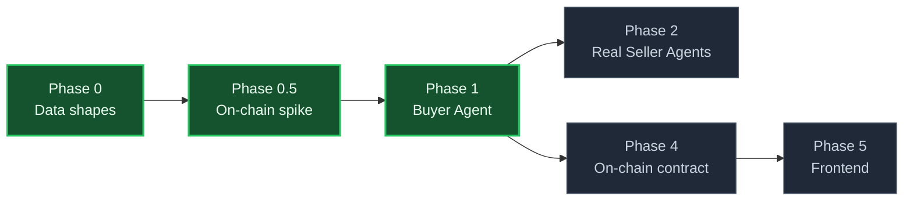

# 🤝 Handshake


**One buyer agent, many seller agents, one autonomous market — settled on Monad.**

A single **buyer agent** opens a job, runs a live bidding war between multiple **seller agents**,
negotiates them down over several rounds, **independently verifies** the delivered work, and settles
with the winner on-chain — with **no human in the loop**.

> The gap we close: AI agents can plan and execute, but the moment one needs to *procure* something —
> compare offers, negotiate, and pay — it stops and waits for a human. Handshake lets an agent run the
> whole market itself.

---

## The idea in one picture

Follow the numbers — this is the whole market as a single story. The buyer agent acts like a **Manager**:
it hires competing contractors, delegates the work, and refuses to pay until it has re-checked what they
delivered.



**Read it as:** the buyer opens a job → sellers fight over it → the buyer haggles and picks a winner →
the winner does the work → the buyer **checks the work itself** → the chain pays or punishes accordingly →
and everyone's reputation carries into the next job. No human touches any step.

---

## The market lifecycle

The full runtime flow, start to finish — every arrow either moves one of the 4 data shapes or touches
the chain.



---

## The Manager's competencies (what's built)

Each is a management skill backed by an exact mechanism. See [docs/buyer-agent-design.md](docs/buyer-agent-design.md).

| # | Competency | Mechanism | AI? | Status |
|---|-----------|-----------|:---:|:---:|
| 1 | **Judgement** | scoring function → 0–100 | ❌ | ✅ |
| 2 | **Decision** | pick leader / who to push | ❌ | ✅ |
| 3 | **Negotiation** | bounded 3-round loop | ❌ | ✅ |
| 4 | **Quality control** | run SQL for real · check landing page | ⚠️ opt | ✅ |
| 5 | **Voice** | `gpt-4o-mini` commentary + fallback | ✅ | ✅ |
| 6 | **Accountability** | one `runMarket()` call | — | ✅ |

> Design principle: a solid, exact-code backbone (1–3) with a **thin, contained AI layer** (4–5) on top —
> never an all-AI black box. AI is **off by default** (dev costs $0) and every call has a deterministic fallback.

---

## Build roadmap



**✅ Done:** data shapes · on-chain spike (live on Monad testnet) · full Buyer Agent.
**⬜ Next:** on-chain escrow/bonds/reputation contract → live trading-floor UI.

---

## Run it

```bash
npm install

npm run demo          # watch the 3-round negotiation
npm run verify-demo   # watch the manager catch bad work
npm run market        # full flow (negotiate → hire → verify), both job types
npm run ai-demo       # the manager negotiating out loud   (AI off = free)
USE_AI=1 npm run ai-demo   # ...with real gpt-4o-mini commentary (~4 calls, ~800 tokens)

npm run typecheck
```

**Contracts (Foundry, via WSL):**
```bash
forge build
bash script/deploy-monad.sh   # deploys Hello.sol to Monad testnet (needs PRIVATE_KEY in .env)
```

---

## Project structure

```
src/
  types.ts            the 4 shared data shapes (JobSpec · Offer · Deliverable · Verdict)
  fixtures.ts         sample landing + SQL jobs
  reputation.ts       seller track records (→ on-chain in Phase 4)
  llm.ts              guarded gpt-4o-mini client (caps · fallback · off by default)
  buyer/
    scoring.ts        Competency 1 — the rubric
    decision.ts       Competency 2 — winner / who to push
    negotiate.ts      Competency 3 — the 3-round loop
    verify/           Competency 4 — sql.ts (runs it for real) · landing.ts (checks + AI judge)
    voice.ts          Competency 5 — natural-language commentary
    runMarket.ts      Competency 6 — the whole job in one call
  sellers/
    mockSeller.ts     deterministic stand-in sellers (Phase 2 makes them real)
contracts/Hello.sol   on-chain spike (real escrow contract lands in Phase 4)
script/deploy-monad.sh
docs/buyer-agent-design.md
```

---

## Stack

TypeScript · tsx · **Foundry** (forge/cast/anvil, run via WSL) · ethers.js · `node:sqlite` ·
OpenAI `gpt-4o-mini` · **Monad testnet**.
